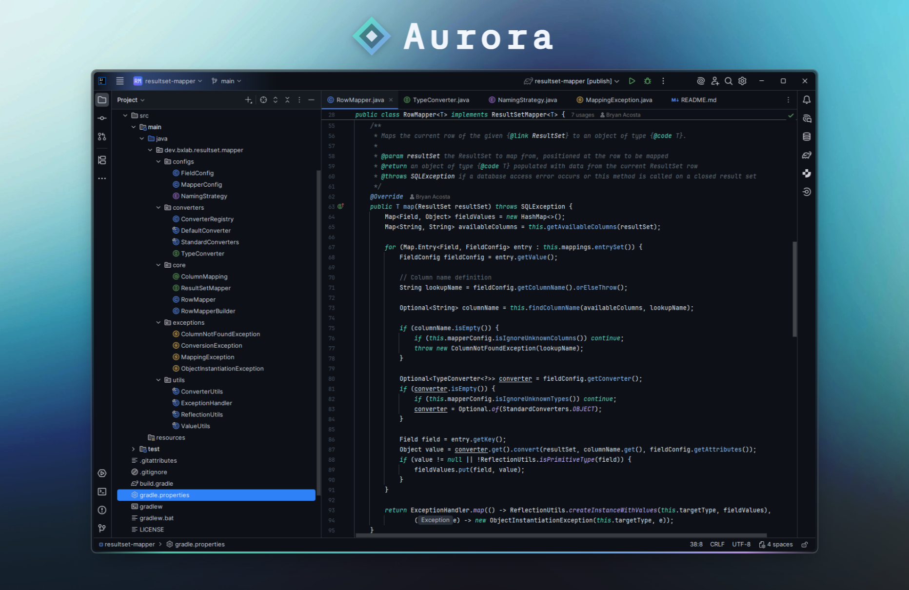

# Aurora Theme

A minimalistic dark theme for JetBrains IDEs with clean syntax highlighting.

## Installation

1. Download the latest release from [Releases](https://github.com/bxacosta/aurora-theme/releases)
2. Go to `File` → `Settings` → `Plugins`
3. Click the gear icon and select `Install Plugin from Disk`
4. Select the downloaded `.jar` file
5. Restart your IDE
6. Go to `File` → `Settings` → `Editor` → `Color Scheme`
7. Select `Aurora` from the dropdown

## Inspiration

This theme was inspired by the following projects:

- [Poimandres JetBrains](https://github.com/marko-mihajlovic/poimandres-jetbrains)
- [JetBrains GitHub Dark Theme](https://github.com/toby-j/jetbrains-github-dark-theme)
- [One Dark JetBrains Theme](https://github.com/one-dark/jetbrains-one-dark-theme)

## License

This project is licensed under the [MIT License](LICENSE).